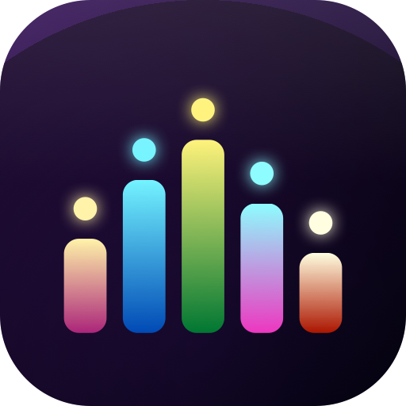
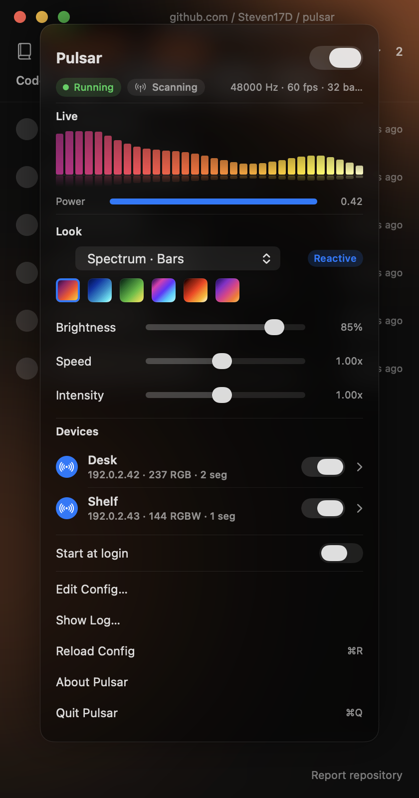
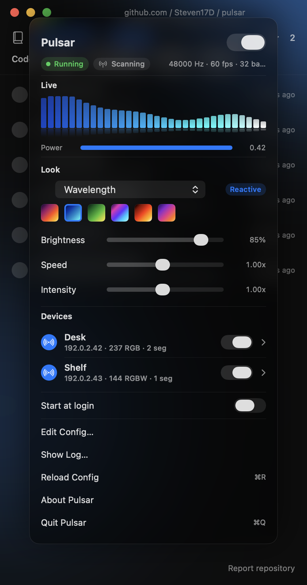
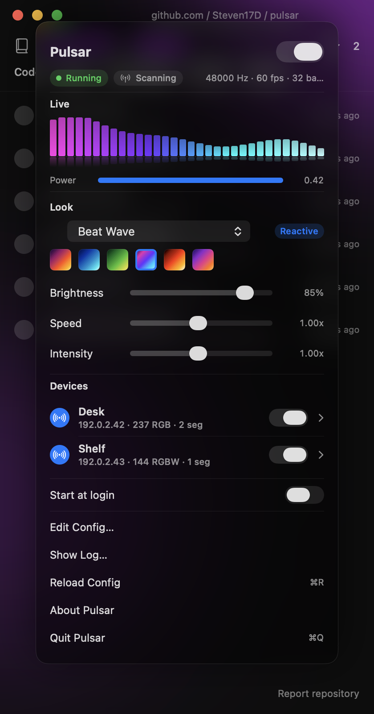
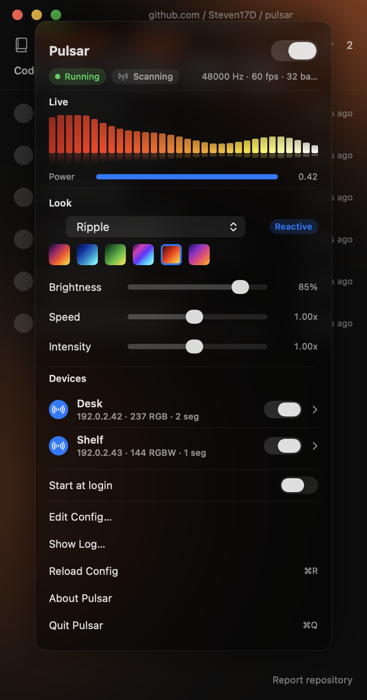

<h1 align="center">
  <br>
  Pulsar
</h1>

<p align="center"><em>Your Mac plays music. Your room dances along.</em></p>

<p align="center">
  <a href="https://github.com/Steven17D/pulsar/actions/workflows/ci.yml"></a>
  <a href="https://github.com/Steven17D/pulsar/releases"></a>
  <a href="LICENSE"></a>
  <a href="https://www.apple.com/macos/"></a>
</p>

Pulsar is a tiny menu-bar app that listens to whatever your Mac is playing
and drives [WLED](https://kno.wled.ge/) LED strips in time with the music.
Spotify, YouTube, a movie, a game — if it makes sound, your lights react.

<p align="center">
  
</p>

No virtual audio devices. No hijacking your speakers. No per-app loopback.
Pulsar uses Apple's **Process Tap API** to read system audio directly, so
your volume keys, your AirPods, and the macOS volume OSD all keep working
exactly as they should.

> **Status:** alpha. The core pipeline (tap → FFT → DDP) is stable. The
> config schema and effect list are still allowed to move.

## Highlights

- 🎧 **Reads system audio cleanly.** Process Tap API on macOS 14.4+ — no
  BlackHole, no LedFx-style default-device hijack. Works over Bluetooth.
- 💡 **Drives any number of WLED strips at once** via DDP/UDP at 60 Hz.
  RGB and RGBW. Multiple devices in parallel.
- 🌈 **11 built-in effects** across reactive (gated on audio) and ambient
  (keep playing on silence) modes, plus 6 palettes.
- 🎛️ **Per-slider audio reactivity.** Brightness, Speed, and Intensity
  each have a waveform-pill toggle and a gear popover — pick what drives
  them: Power, Bass, Treble, or Beat Onset.
- 🪟 **SwiftUI menu-bar panel** with a live spectrum, power meter, and a
  full Control-Center-style UI. Translucent, native, no Electron.
- 🔌 **Segment-aware.** Auto-discovers each WLED's segments via
  `/json/cfg`; reverse and mirror per segment. Per-device PSU floor for
  flaky power supplies.
- 🩹 **Self-healing.** Survives `coreaudiod` restarts and default-output
  swaps; the engine respawns on its own.
- 🔒 **One permission, scoped tight.** Audio Capture only. No mic, no
  screen recording, no accessibility, no full disk.

## Effects

| Mode | Effects |
| ---- | ------- |
| **Reactive** (needs audio) | Spectrum Bars · Wavelength · Beat Wave · Ripple · Glitter |
| **Ambient** (plays on silence) | Rainbow · Breathe · Comet · Plasma · Solid · Test |

Reactive effects gate on audio; ambient effects ignore silence and keep
moving. Plasma is a hybrid — it drifts on its own and accelerates with
audio power. Rainbow uses the literal HSV spectrum and ignores the
palette so it always looks like a rainbow.

Palettes: Sunset · Ocean · Forest · Cyberpunk · Fire · Twilight. Add your
own in `Sources/Pulsar/Palette.swift`.

## Gallery

| Spectrum / Sunset | Wavelength / Ocean | Beat Wave / Cyberpunk | Ripple / Fire |
| :---: | :---: | :---: | :---: |
|  |  |  |  |

## Install

You'll need macOS 14.4 or later, the Xcode Command Line Tools, and at
least one WLED controller on your LAN.

```sh
xcode-select --install            # if you don't already have it
git clone https://github.com/Steven17D/pulsar.git
cd pulsar
./scripts/build.sh
open ~/Applications/Pulsar.app
```

`build.sh` codesigns the bundle ad-hoc (hardened runtime + Audio Capture
entitlement) and installs it to `~/Applications/Pulsar.app`. On first
launch, macOS will ask for **Audio Capture** — approve it under
*System Settings → Privacy & Security → Audio Capture*.

Want it to start automatically? Toggle *Start at login* in the menu-bar
panel.

## Using it

1. Click the Pulsar icon in the menu bar.
2. Pulsar auto-discovers WLED devices on your LAN via mDNS — tap *Add*
   on any you'd like to drive.
3. Pick an effect and a palette.
4. Tweak Brightness, Speed, and Intensity. Tap the little waveform
   icon next to a slider to make that slider react to the music. Tap
   the gear next to it to pick which aspect — Power, Bass, Treble, or
   Beat — drives it.

That's it.

## Configuration

Pulsar writes `~/.config/pulsar/config.json` whenever you change something
in the UI, so most people never need to touch it. If you want to:

```json
{
  "fps": 60, "fft_size": 1024, "band_count": 32, "smoothing": 0.6,
  "min_freq_hz": 40, "max_freq_hz": 16000,
  "enabled": true, "effect": "spectrum", "palette": "sunset",
  "speed": 1.0, "intensity": 1.0,
  "devices": [{
    "name": "Desk", "ip": "192.0.2.42", "pixel_count": 237,
    "rgbw": false, "brightness": 1.0, "enabled": true,
    "min_load": 0.0,
    "segments": [
      { "start": 0,   "length": 119, "reverse": false, "mirror": false },
      { "start": 119, "length": 118, "reverse": true,  "mirror": false }
    ]
  }]
}
```

`min_load` (0–0.5) raises every output channel to at least that fraction
of full scale, keeping flaky PSUs above their minimum stable current.
Leave at `0` unless your strip flickers on near-black frames.

## Architecture

```
Core Audio Tap → FFT (vDSP) → Mapper (palette + effect) → DDP/UDP → WLED
                                                                ↓
                                  SwiftUI MenuBarExtra ← live frame
```

- The Process Tap callback writes mono PCM into a lock-protected ring
  buffer; no allocations on the IOProc.
- A dedicated render thread pulls the latest FFT window every `1/fps`
  seconds, runs the active effect, and emits DDP frames per device.
- Two `ObservableObject`s (`LiveStore` at 60 Hz, `SettingsStore` for
  low-frequency state) keep live updates from invalidating the entire
  toggle/slider tree.

## Troubleshooting

- **`TCC Denied` pill.** System Settings → Privacy & Security → Audio
  Capture → Pulsar.
- **`Audio Lost`.** `coreaudiod` restarted or the default output
  swapped. Pulsar self-respawns within ~2 s; if it stays red:
  `sudo killall coreaudiod`, then relaunch.
- **Stripes when sending RGBW.** WLED is configured for RGB on an
  SK6812 strip. Set `"rgbw": false` for that device.

## Development

```sh
swift build               # debug
swift test                # unit tests
swift build -c release    # release
./scripts/build.sh        # build + install ~/Applications/Pulsar.app
./scripts/package.sh      # build Pulsar.zip for distribution
swift gen-icon.swift      # regenerate AppIcon.icns
```

The interesting bits live in `Sources/Pulsar/`:

| File | What it does |
| ---- | ------------ |
| `Tap.swift` + `CoreAudioUtils.swift` + `TCC.swift` | Process Tap + aggregate device + permission prompt |
| `FFT.swift` | vDSP-backed spectrum analyzer |
| `Mapper.swift` | All effect rendering + palette sampling |
| `Palette.swift` | Built-in palettes and the sampler |
| `DDP.swift` | DDP/UDP wire format and sender |
| `AudioEngine.swift` | The render thread; computes audio features and modulates per-slider |
| `BarView.swift` | The SwiftUI menu-bar panel |
| `ControlModel.swift` | All app state + persistence |

See [CONTRIBUTING.md](CONTRIBUTING.md) for the full contribution flow.

### Screenshot harness

Set `PULSAR_SHOWCASE=1` to launch with mock data in a regular window
(no Process Tap, no TCC prompt). Set `PULSAR_SHOWCASE_RENDER=<dir>` to
render PNGs of several effect/palette variants and exit.

## Security

Pulsar uses the Audio Capture entitlement and sends outbound traffic
only to configured WLED devices. Report vulnerabilities privately per
[SECURITY.md](SECURITY.md).

## Acknowledgments

- [WLED](https://kno.wled.ge/) — firmware + DDP protocol.
- [audiotee](https://github.com/insidegui/audiotee) — Process Tap +
  aggregate-device reference.
- [LedFx](https://www.ledfx.app/) — for showing what's possible.

## License

[MIT](LICENSE).
